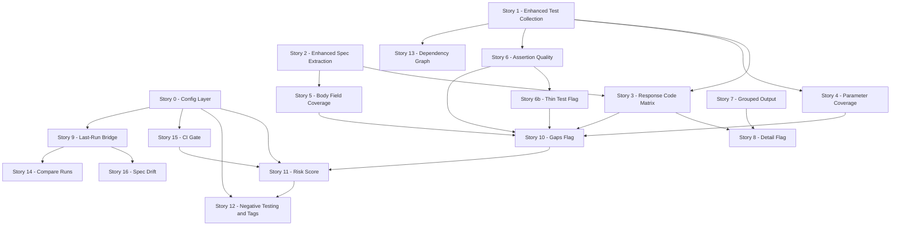

# Shogun Coverage v2 — Revised Plan (Post Test-Team Feedback)

**Date:** 2026-07-03
**Author:** enigma-prime (architect)
**Supersedes:** [`coverage-v2-plan.md`](coverage-v2-plan.md) (original v2 plan)
**Incorporates:** [`shogun-coverage-report-v2-test-team-feedback.md`](shogun-coverage-report-v2-test-team-feedback.md) (ab-shield review)

---

## 0. What Changed

The test team (ab-shield) reviewed the original v2 plan and gave it a strong endorsement. Their feedback converges on one dominant theme — **configurability** — plus a handful of precision improvements to the heuristics. No stories were rejected; several were refined. This revised plan:

1. **Adds a config layer** (`coverage:` block in `shogun.config.yaml`) so teams can tune risk weights, tag mappings, default suite, and min-coverage thresholds without code changes.
2. **Refines the assertion quality score** — drops the pre-script weight, normalizes per-endpoint, adds a "thin test" flag.
3. **Inlines spec drift into the response code matrix** rather than relegating it to a separate section.
4. **Adds test-vs-reality mismatch detection** (test expects 400, API returned 200).
5. **Tightens the dependency-graph heuristic** to require assignment/read syntax.
6. **Adds per-endpoint negative-testing ratios** and per-dimension `--min-coverage` thresholds.
7. **Strengthens `--last-run` error handling** — no silent fallback to static-only.

The story count grows from 16 → 18 (config layer + thin-test flag split out), but the implementation waves are unchanged in spirit.

---

## 1. The Config Layer (NEW — Story 0)

All team-tunable knobs live in a `coverage:` block in [`shogun.config.yaml`](local-dev-test-repo/shogun.config.yaml:1). Sensible defaults ship out-of-the-box; teams override only what they need.

```yaml
coverage:
  # When --last-run is used without --suite, filter to this suite's runs.
  # Omit to fall back to truly latest run (current behavior).
  defaultSuite: tsap

  # Per-dimension risk-score weights (0-1). Defaults shown.
  riskWeights:
    responseCodeGap: 0.35
    parameterGap: 0.15
    bodyFieldGap: 0.15
    assertionQuality: 0.20
    runResults: 0.15   # failing tests, slow responses

  # Method → expected test tags. Endpoints missing expected tags are flagged.
  # Teams override to match their tag taxonomy.
  expectedTagsByMethod:
    GET:    [readonly]
    POST:   [crud, validation]
    PATCH:  [crud]
    PUT:    [crud, validation]
    DELETE: [crud, guard]

  # Per-dimension coverage thresholds for --min-coverage CI gate.
  # Omit a dimension to skip checking it.
  minCoverage:
    endpoint: 100
    responseCode: 80
    parameter: 70
    bodyField: 70
```

**Design principles:**
- Every config key is optional. With no `coverage:` block, shogun behaves exactly as the original v2 plan specified (hard-coded defaults).
- Config is loaded via the existing [`loadConfig()`](src/loader.ts:1) path — no new loader needed, just a new typed section.
- Unknown keys are warned, not errored (forward-compatibility).

---

## 2. Refined Dimensions

### Dimension 1: Endpoint Coverage — unchanged ✅

### Dimension 2: Response Code Coverage — refined ✅✅

The three-layer model (spec-declared / test-declared / run-actual) is kept. **Two changes from feedback:**

**Change A — Inline drift in the matrix.** Undocumented actual codes appear inline with a `⚠️` marker, not buried in a separate drift section. A reviewer scanning the matrix sees drift immediately:

```
POST /api/users        Spec: 201, 400, 403, 404
  Declared:  201 ✓  400 ✓  403 ✓  404 ✗
  Actual:    201 ✓  500 ⚠️  403 ✓  —       ← 500 not in spec!
  Drift:     500 returned but not documented
```

**Change B — Test-vs-reality mismatch detection.** When run data is available, flag cases where the test's expected status differs from the API's actual status (e.g., test expects 400, API returned 200). This is distinct from spec drift (both codes may be documented) — it's a *test failure signal* surfaced in the coverage view:

```
POST /api/users
  Mismatch: test expects 400, API returned 200  ← test-vs-reality drift
```

### Dimension 3: Parameter Coverage — unchanged, with a noted future enhancement ✅

The "format coverage" idea (valid UUID / invalid UUID / non-existent UUID) is explicitly deferred as scope creep. The basic "was this parameter exercised at all" remains the 80/20. Documented as a future iteration in §8.

### Dimension 4: Request Body Field Coverage — unchanged, with a noted future enhancement ✅

"Field value diversity" (tracking distinct values per field, e.g., `role` always `"Admin"`) is explicitly deferred. Documented as a future iteration in §8.

### Dimension 5: Assertion Quality Score — refined ✅

Four changes from feedback:

1. **Pre-script weight dropped.** A pre-script that sets up a UUID is test infrastructure, not an assertion. It inflated scores without measuring verification depth. The weight table is now:

   | Signal | Weight | Source |
   |--------|--------|--------|
   | Status assertion present | 1 | `response.status` in YAML |
   | Shape assertions present | 2 × count of entries | `response.shape[]` in YAML |
   | Snapshot comparison enabled | 3 | `response.snapshot` in YAML |
   | Post-script assertions | 1 × count of `assert(` calls | `post` script body scan |

   *(Pre-script presence is still collected as metadata — it's just not scored.)*

2. **Shape weight confirmed as per-entry.** The implementation counts entries in `response.shape[]`, not "tests-with-shape." A test with 6 shape entries scores `2 × 6 = 12`, not `2 × 1 = 2`. This is now an explicit implementation note, not an assumption.

3. **Per-endpoint normalization.** The quality score is aggregated per endpoint (combining all tests targeting that endpoint), normalized to 0–100. This gives a more actionable "this endpoint's tests are thin" signal than individual test scores. Individual test scores are still available in `--detail`.

4. **"Thin test" flag (NEW — Story 6b).** Any test scoring ≤ 1 (status-only, no shape, no post-script asserts) gets a `⚠️ thin` flag. More actionable than a raw number — a reviewer can immediately filter to thin tests.

---

## 3. `--last-run` Integration — refined ✅✅

Elevated above P2 (as in the original plan). Two refinements from feedback:

**Refinement A — `defaultSuite` config applies.** When `--last-run` is used without `--suite`, and `coverage.defaultSuite` is configured, shogun loads the latest run *matching that suite*. This solves the "debug run clobbers the full-suite run" problem:

- `shogun coverage --last-run` → latest run where `suite == "tsap"` (if configured)
- `shogun coverage --last-run --suite smoke` → overrides to smoke
- `shogun coverage --last-run --suite any` → truly latest run regardless of suite
- No `defaultSuite` configured → truly latest run (current behavior)

The same logic applies to `--compare` without explicit run IDs: default to "last two runs of defaultSuite."

**Refinement B — No silent fallback.** When `--last-run` is used but no run exists for the resolved suite, shogun prints a clear, actionable error and exits non-zero:

> *"No tsap run found. Run `shogun run --suite tsap` first, or use `--suite <name>` to target a different suite."*

It does **not** silently fall back to static-only. Silent fallback hides the problem and produces a misleading report.

The opt-in design is otherwise unchanged: the default coverage report remains static-only (no HTTP, read-only) for CI gate usage.

---

## 4. Intelligence Layer — refined

### 5.1 Coverage Risk Score — refined ✅✅

Weights are now **configurable** via `coverage.riskWeights` (see §1). The defaults remain sensible, but teams can tune what "risk" means for their context. ab-shield noted that for them, response code gaps and failing tests should weigh heavier than body field gaps — the config makes this possible without code changes.

### 5.2 Test Dependency Graph — refined ✅

**Tighter heuristic.** Instead of bare substring matching for `ctx.vars.foo`, the scanner requires syntax context:
- **Writes:** `ctx.vars.foo = ...` (assignment)
- **Reads:** `ctx.vars.foo` *not* preceded by `=` (consumption)

This eliminates false positives from log messages like `ctx.log("ctx.vars.foo is set")`. Still heuristic, but materially more precise.

### 5.3 Negative Testing Coverage — refined ✅

**Per-endpoint ratio added.** In addition to the suite-wide 2xx/4xx/5xx ratio, each endpoint shows its own ratio. An endpoint with only 2xx tests has a different risk profile than one with a 2xx/4xx mix, regardless of the overall suite ratio:

```
POST /api/users      2xx: 15  4xx: 6  5xx: 0   ratio: 71%/29%/0%
GET /api/health      2xx: 3   4xx: 0  5xx: 0   ratio: 100%/0%/0%  ⚠️ no error paths
```

### 5.4 Test Tag Intelligence — refined ✅

**Method→expected-tags mapping is now configurable** via `coverage.expectedTagsByMethod` (see §1). Defaults ship for common methods; teams override to match their tag taxonomy. ab-shield's taxonomy (`crud`, `guard`, `validation`, `behaviors`, `readonly`, `smoke`) differs from a generic default — the config makes this adaptable.

### 5.5 Spec Drift Detection — refined ✅✅

Two detection modes (both require `--last-run`):

1. **Undocumented actual codes** (original) — API returned a code not in the spec. Now also **inlined in the response code matrix** (see §2, Dimension 2, Change A), not just in a separate section.

2. **Test-vs-reality mismatches** (new) — test expects 400, API returned 200. Both codes may be documented, so this isn't spec drift — it's a *test failure signal* surfaced in the coverage view (see §2, Dimension 2, Change B).

---

## 5. Structural/UX Improvements — refined

| Feature | Status | Refinement |
|---------|--------|------------|
| `--gaps` (replaces `--uncovered`) | ✅ | Unchanged — multi-dimensional gap view. |
| `--min-coverage` | ✅ | **Now supports per-dimension thresholds** via `coverage.minCoverage` config (e.g., `endpoint: 100`, `responseCode: 80`). CLI flag `--min-coverage 80` still works as a single global threshold for backward compat. |
| `--out` + JSON truncation fix | ✅ | Unchanged — file-based writing, no stdout buffer. |
| Grouped output by tag | ✅ | Unchanged. |
| `--detail` progressive disclosure | ✅ | Unchanged. |
| `--compare` | ✅ | `defaultSuite` config applies to run resolution. |

---

## 6. Revised Story Breakdown

Stories 1–16 are retained from the original plan with refinements noted. Two new stories (0 and 6b) are added.

### Story 0: Coverage Config Layer (NEW)
**Goal:** Add the `coverage:` config block to [`shogun.config.yaml`](local-dev-test-repo/shogun.config.yaml:1) with typed loading and defaults.
**Scope:** Extend [`loadConfig()`](src/loader.ts:1) to parse `coverage.defaultSuite`, `coverage.riskWeights`, `coverage.expectedTagsByMethod`, `coverage.minCoverage`. All optional with defaults. Warn on unknown keys.
**Files:** [`src/loader.ts`](src/loader.ts:1), [`src/types.ts`](src/types.ts:1) (new `CoverageConfig` type).
**Value:** Foundation for all configurable features. Ships first so downstream stories can consume config.

### Story 1: Enhanced Test Collection — unchanged
### Story 2: Enhanced Spec Extraction — unchanged
### Story 3: Response Code Coverage Matrix — refined
**Refinement:** Inline undocumented actual codes with `⚠️` in the matrix (not separate section). Add test-vs-reality mismatch detection when run data is available.

### Story 4: Parameter Coverage — unchanged
### Story 5: Request Body Field Coverage — unchanged

### Story 6: Assertion Quality Metrics — refined
**Refinement:** Drop pre-script weight. Confirm shape weight is per-entry. Normalize score per-endpoint to 0–100.

### Story 6b: Thin Test Flag (NEW)
**Goal:** Flag tests scoring ≤ 1 as `⚠️ thin`.
**Scope:** In the analyzer, after computing per-test quality score, set `isThin: boolean` when score ≤ 1. Surface in `--gaps` and `--detail` output.
**Files:** Coverage analyzer + reporters.
**Value:** Immediately actionable filter for low-quality tests.

### Story 7: Grouped Output by Spec Tag — unchanged
### Story 8: `--detail` Flag — unchanged

### Story 9: `--last-run` Integration — refined
**Refinement:** Apply `defaultSuite` config to run resolution. No silent fallback — clear error + non-zero exit when no run found for resolved suite.

### Story 10: `--gaps` Flag — unchanged (includes thin tests from Story 6b)

### Story 11: Coverage Risk Score — refined
**Refinement:** Weights read from `coverage.riskWeights` config.

### Story 12: Negative Testing & Tag Intelligence — refined
**Refinement:** Per-endpoint negative-testing ratio. Method→expected-tags mapping from `coverage.expectedTagsByMethod` config.

### Story 13: Test Dependency Graph — refined
**Refinement:** Require assignment/read syntax for `ctx.vars` scanning (writes: `ctx.vars.X =`, reads: `ctx.vars.X` not preceded by `=`).

### Story 14: `--compare` — refined
**Refinement:** `defaultSuite` config applies to run resolution when explicit run IDs not given.

### Story 15: `--min-coverage` CI Gate + `--out` + JSON Fix — refined
**Refinement:** `--min-coverage` supports per-dimension thresholds from `coverage.minCoverage` config. Single-number CLI flag remains as global threshold.

### Story 16: Spec Drift Detection — refined
**Refinement:** Drift inlined in response code matrix (Story 3). Add test-vs-reality mismatch detection.

---

## 7. Revised Implementation Waves



**Wave 1 — Foundations + highest value:**
- Story 0 (config layer), Story 1 (test collection), Story 2 (spec extraction), Story 3 (response code matrix), Story 7 (grouped output)

**Wave 2 — Depth dimensions:**
- Story 4 (parameter coverage), Story 5 (body field coverage), Story 6 (assertion quality), Story 6b (thin test flag), Story 8 (detail flag)

**Wave 3 — Intelligence:**
- Story 9 (last-run bridge), Story 10 (gaps flag), Story 11 (risk score)

**Wave 4 — Advanced:**
- Story 12 (negative testing + tags), Story 13 (dependency graph), Story 14 (compare), Story 15 (CI gate + JSON fix), Story 16 (spec drift)

---

## 8. Explicitly Deferred (Future Iterations)

These were suggested by the test team but are out of scope for v2 to keep focus:

| Feature | Why Deferred |
|---------|-------------|
| **Parameter format coverage** (valid UUID / invalid UUID / non-existent UUID) | Scope creep beyond "was this param exercised." The 80/20 is presence coverage. |
| **Body field value diversity** (distinct values per field, e.g., `role` always `"Admin"`) | Harder to implement; requires parsing body values across all tests. High effort, deferred. |
| **Response schema field coverage** (which response body fields have shape assertions) | High effort, lower value than risk score. Carried over from original plan's deferral. |
| **Multi-run historical trend** (beyond 2-run `--compare`) | `--compare` covers 2-run trend. Multi-run dashboards are a future possibility. |

---

## 9. Feedback Disposition Matrix

Every point from the test team's feedback, mapped to its resolution:

| Feedback Area | Resolution | Story |
|---------------|------------|-------|
| TSAP default via config, not hardcode | `coverage.defaultSuite` config | Story 0, 9, 14 |
| `defaultSuite` applies to `--compare` too | Yes — run resolution uses it | Story 14 |
| Clear error when no run found, no silent fallback | Non-zero exit + actionable message | Story 9 |
| Inline undocumented actual codes in matrix | `⚠️` marker inline in response code matrix | Story 3, 16 |
| Detect test-vs-reality mismatches | New mismatch detection in matrix | Story 3, 16 |
| Drop pre-script weight from quality score | Removed from weight table | Story 6 |
| Confirm shape weight is per-entry | Explicit implementation note | Story 6 |
| Per-endpoint quality normalization (0–100) | Per-endpoint aggregate score | Story 6 |
| "Thin test" flag for score ≤ 1 | `isThin` flag + `--gaps`/`--detail` surfacing | Story 6b |
| Risk score weightings configurable | `coverage.riskWeights` config | Story 0, 11 |
| Dependency graph: require assignment/read syntax | Tighter regex with syntax context | Story 13 |
| Negative testing ratio per endpoint | Per-endpoint 2xx/4xx/5xx ratio | Story 12 |
| Tag intelligence: configurable method→expected-tags | `coverage.expectedTagsByMethod` config | Story 0, 12 |
| `--min-coverage` per-dimension thresholds | `coverage.minCoverage` config + CLI global | Story 0, 15 |
| Body field value diversity | Deferred (§8) | — |
| Parameter format coverage | Deferred (§8) | — |

---

## 10. Next Steps

1. **Review this revised plan** — confirm the config layer design and the deferred items are acceptable.
2. **Switch to Code mode** — implement Wave 1 (Stories 0, 1,2,3,7).
