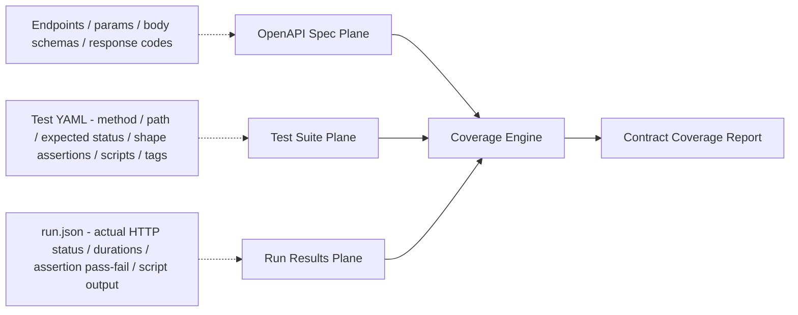
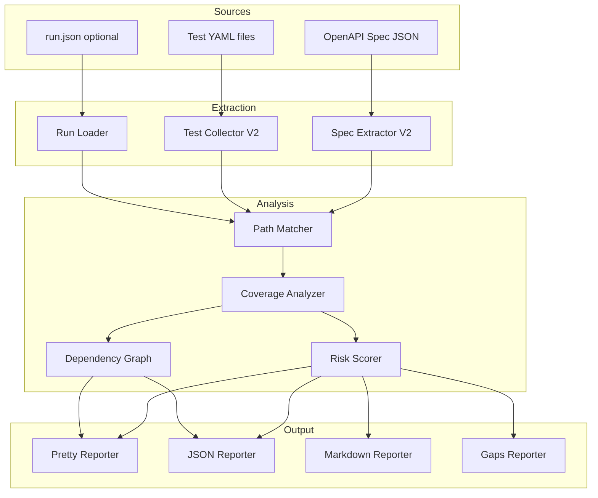
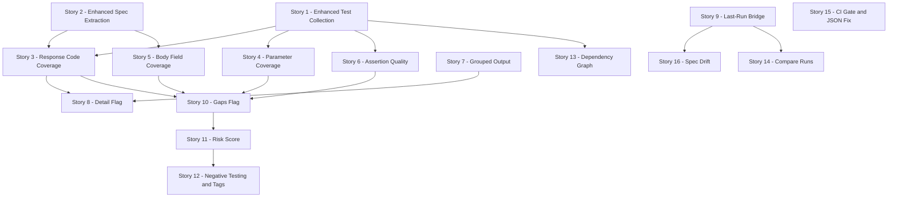

# Shogun Coverage v2 — The Peerless Coverage Report

**Date:** 2026-07-03
**Author:** enigma-prime (architect)
**Companion to:** [`shogun-coverage-report-improvements.md`](shogun-coverage-report-improvements.md) (team field report)

---

## 0. Executive Summary

The team's field report is excellent and accurate. It correctly identifies that the current `shogun coverage` command answers only the thinnest possible question — *"did at least one test touch this endpoint?"* — and that "100% coverage" is misleading without depth.

This plan takes the team's findings as a **floor, not a ceiling**. The goal is to build a coverage report that no other API testing tool produces — one that fuses the OpenAPI contract, the test suite's structural metadata, and live run results into a single **contract-coverage intelligence layer**. Where the team's report lists 14 improvements in priority tiers, this plan organizes the work around a coherent product vision with a clear data architecture, then breaks it into shippable stories.

The north star: **coverage should evolve from "did we touch this endpoint?" to "did we exercise this endpoint's documented contract — and what did the API actually do when we did?"**

---

## 1. The Core Insight: Three Data Planes, Fused

Shogun sits on top of three rich data planes that have never been cross-referenced:



| Plane | Source | What it tells us |
|-------|--------|-----------------|
| **Spec** | OpenAPI JSON via [`fetchSpec()`](src/loader.ts:516) | What the API *promises* — endpoints, parameters, body schemas, documented response codes |
| **Test Suite** | Test YAML files in `tests/collections/` | What the tests *intend* — expected status, shape assertions, snapshot usage, tags, pre/post scripts |
| **Run Results** | `run.json` in `runs/` directory (via [`loadLatestRun()`](src/logger.ts:96)) | What *actually happened* — real HTTP statuses, durations, assertion outcomes |

The current coverage command uses only the **Spec plane** (endpoints list) and a sliver of the **Test Suite plane** (method + path). The Run Results plane is entirely ignored. Fusing all three is what makes this peerless.

---

## 2. Coverage Dimensions — From Flat to Multi-Axial

The current report has one dimension: **endpoint presence** (covered / not covered). The v2 report introduces five coverage dimensions, each independently measurable and reportable:

### Dimension 1: Endpoint Coverage (existing, refined)
*"Did at least one test target this endpoint?"*

This is what we have today. It stays as the baseline metric but becomes one row in a richer matrix rather than the whole story.

### Dimension 2: Response Code Coverage
*"Did we exercise every documented response code for this endpoint?"*

Cross-references the spec's documented response codes (200, 201, 400, 403, 404, 503, etc.) against:
- **Test-declared codes** — `response.status` in test YAML (what the test *expects*)
- **Run-actual codes** — `httpStatus` in run.json (what the API *returned*) — requires `--last-run`

```
POST /api/users        Spec: 201, 400, 403, 404
  Declared:  201 ✓  400 ✓  403 ✓  404 ✗
  Actual:    201 ✓  400 ✓  403 ✓  —
```

### Dimension 3: Parameter Coverage
*"Did we exercise each documented query/path parameter?"*

Cross-references spec parameter definitions against test YAML `request.params` and query strings in `request.path`. For parameters set dynamically in `pre` scripts, we scan the script body for `ctx.request.params[...]` assignments (heuristic, flagged as "inferred").

### Dimension 4: Request Body Field Coverage
*"Did we exercise each documented body field?"*

Cross-references the spec's request body schema (resolved via the same `$ref` resolution already in [`spec.ts`](src/commands/spec.ts:701)) against:
- Inline `request.body.inline` in test YAML
- Fixture file bodies (`request.body.file`)
- `ctx.request.body = {...}` assignments in `pre` scripts (heuristic scan)

### Dimension 5: Assertion Quality Score
*"How deeply does each test verify the response?"*

Not a binary covered/uncovered — a per-test quality score based on assertion density:

| Signal | Weight | Source |
|--------|--------|--------|
| Status assertion present | 1 | `response.status` in YAML |
| Shape assertions present | 2 × count | `response.shape[]` in YAML |
| Snapshot comparison enabled | 3 | `response.snapshot` in YAML |
| Post-script assertions | 1 × count of `assert(` calls | `post` script body scan |
| Pre-script present (setup complexity) | 0.5 | `pre` script presence |

A test with only `status: 200` scores **1**. A test with status + 3 shape checks + 2 post-script asserts scores **9**. This surfaces "thin tests" that hide behind a green checkmark.

---

## 3. The Run Results Bridge — `--last-run` Integration

This is the single most transformative addition. The team's report lists it as P2, but I'm elevating it because it unlocks dimensions that static analysis alone cannot.

When `--last-run` (or `--run <id>`) is passed, the coverage command loads `run.json` via the existing [`loadRunById()`](src/logger.ts:111) / [`loadLatestRun()`](src/logger.ts:96) functions and joins run results to test entries by test name + collection.

This enables:

| Metric | What it reveals |
|--------|----------------|
| **Actual HTTP status distribution** | Which codes the API *really* returned — not just what tests expected |
| **Spec-vs-actual code reconciliation** | Spec says 503 is possible, tests expect 200, API returned 200 — 503 path is untested |
| **Pass/fail per endpoint** | Which endpoints are currently green vs. red |
| **Assertion outcome breakdown** | How many shape assertions actually passed vs. failed |
| **Duration / performance** | Avg and p95 response times per endpoint |
| **Flakiness signal** | (with `--compare`) whether an endpoint's pass/fail status changed between runs |

**Key design decision:** `--last-run` is opt-in. The default coverage report remains static (spec + test YAML only) so it works without a prior run. This preserves the "no HTTP, read-only" guarantee from the [original product story](docs/product-stories/coverage-command.md:346).

---

## 4. Structural & UX Improvements

### 4.1 Grouped Output by Spec Tag
The flat list of 65 endpoints is unreadable. Group by spec tag with subtotals. This is pure presentation — data already exists.

### 4.2 `--detail` Flag (progressive disclosure)
- **Base report** (default): endpoint coverage + summary stats — compact, scannable
- **`--detail`**: adds response code matrix, parameter coverage, body field coverage, assertion quality per endpoint
- **`--last-run`**: adds actual HTTP statuses, pass/fail, durations

### 4.3 `--gaps` Flag (replaces `--uncovered`)
A smarter gap analysis mode that shows not just uncovered endpoints, but **all coverage gaps**: untested response codes, untested parameters, untested body fields, thin tests. One flag, all gaps.

### 4.4 `--compare <run1> <run2>` Flag
Shows coverage *delta* between two runs: new tests added, tests removed, new endpoints covered, regression in coverage, pass/fail status changes. Requires loading two run.json files.

### 4.5 `--min-coverage <n>` Flag (CI gate)
Exit code 1 if coverage falls below threshold. Pairs with `--gaps` for CI pipelines. Simple, high-value for teams running shogun in CI.

### 4.6 JSON Output Fix
The team reported JSON truncation at ~134KB for 410 tests. This is likely a stdout buffer issue. Fix by writing to a file (`--out coverage.json`) when the payload exceeds a threshold, or by streaming.

### 4.7 `--out <file>` Flag
Write report to a file instead of stdout. Useful for CI artifacts, dashboards, and avoiding truncation. Works with all formats.

---

## 5. Intelligence Layer — Beyond Counting

This is where shogun separates from every other coverage tool. Instead of just counting what's covered, the report provides **actionable intelligence**:

### 5.1 Coverage Risk Score
A per-endpoint risk score (0–100) that combines:
- Response code coverage gap (untested documented codes)
- Parameter coverage gap (untested params)
- Body field coverage gap (untested fields)
- Assertion quality (low score = thin tests)
- Run results (if available: failing tests, slow responses)

Endpoints are sorted by risk score descending — the report leads with the most dangerous gaps.

### 5.2 Test Dependency Graph
Scan `pre`/`post` scripts for `ctx.vars.*` reads and writes. Build a dependency graph showing which tests depend on which other tests' output. Flag:
- **Cascade risk**: tests that depend on a single "feeder" test (if it fails, N tests fail)
- **Orphaned vars**: vars written but never read (dead code)
- **Cross-collection dependencies**: collection A's test depends on collection B's test output

This uses the same script-body heuristic scanning approach as parameter/body detection.

### 5.3 Negative Testing Coverage
Identify tests that exercise error paths by their expected status codes:
- **2xx tests** = happy path
- **4xx tests** = guard/validation testing
- **5xx tests** = failure path testing

Report the ratio. A suite with 90% happy-path tests and 10% error-path tests has a different risk profile than one with 60/40.

### 5.4 Test Tag Intelligence
The team's report suggests a tag distribution matrix. We go further: **tag coverage gaps**. If an endpoint has `crud` tests but no `validation` tests, that's a gap. If it has `guard` tests but no `smoke` tests, that's a gap. Define expected tag coverage per endpoint based on method (POST should have validation, GET should have readonly, etc.).

### 5.5 Spec Drift Detection (with `--last-run`)
When run results are available, detect **spec drift**: the API returned a response code that isn't documented in the spec for that endpoint. This is a legitimate API bug signal — the implementation diverges from the contract.

---

## 6. Architecture & Data Flow

### 6.1 Refactored Coverage Module Structure

The current [`coverage.ts`](src/commands/coverage.ts:1) is a single 522-line file. The v2 scope warrants a modular split:

```
src/commands/coverage/
  index.ts          — entry point, arg parsing, orchestration
  spec-extractor.ts — extract endpoints, params, body schemas, response codes from OpenAPI
  test-collector.ts — collect test entries with full metadata (status, shape, snapshot, scripts)
  run-loader.ts     — load and join run.json results (optional, --last-run/--run)
  matcher.ts        — three-tier path matching (extracted from current coverage.ts)
  analyzer.ts       — compute coverage dimensions, risk scores, gap analysis
  reporter/
    pretty.ts       — terminal output (grouped, progressive disclosure)
    json.ts          — JSON output (with truncation fix)
    markdown.ts      — markdown tables
    gaps.ts          — --gaps mode output
```

### 6.2 Enhanced Data Types

```typescript
// Enhanced TestEntry — captures full test metadata, not just method+path
interface TestEntry {
  name: string;
  file: string;
  collection: string;
  staticPath: string;
  method: string;
  tags: string[];
  // NEW: full metadata for depth analysis
  expectedStatus?: number;
  shapeAssertions: string[];
  snapshotEnabled: boolean;
  hasPreScript: boolean;
  hasPostScript: boolean;
  postScriptAssertCount: number;  // heuristic: count of assert( in post script
  requestBodyFields: string[];     // from inline body or fixture file
  requestParams: string[];         // from request.params or query string
  // Run results (populated only with --last-run)
  runResult?: {
    httpStatus: number;
    durationMs: number;
    status: TestResultStatus;
    assertionResults: AssertionResults;
  };
}

// Enhanced SpecEndpoint — full contract detail
interface SpecEndpoint {
  method: string;
  path: string;
  tag?: string;
  summary?: string;
  // NEW: contract detail
  documentedResponseCodes: string[];      // ["200", "400", "403"]
  parameters: ResolvedParam[];            // from spec.ts types
  requestBodyFields: ResolvedField[];     // from spec.ts types
  tests: TestEntry[];
}
```

### 6.3 Execution Flow (v2)

```
coverage(args)
  │
  ├─ 1. loadConfig + loadEnv (existing)
  ├─ 2. fetchSpec + parse (existing)
  ├─ 3. extractSpecEndpointsV2(openApi, tagFilter)
  │      └─ extract response codes, parameters, body schemas (reuse spec.ts resolvers)
  │
  ├─ 4. collectTestEntriesV2(config, cwd, filters)
  │      ├─ parse full test YAML (not just method+path)
  │      ├─ extract expectedStatus, shape[], snapshot, pre/post presence
  │      ├─ scan pre/post scripts for assert( count, ctx.request.body, ctx.request.params
  │      └─ load fixture file bodies if request.body.file is set
  │
  ├─ 5. [optional] loadRunResults(args.runId, config, cwd)
  │      └─ join run.json results to test entries by name+collection
  │
  ├─ 6. matchTests(testEntries, specEndpoints)  (existing, extracted)
  │
  ├─ 7. analyze(specEndpoints, testEntries, runResults?)
  │      ├─ compute per-endpoint coverage dimensions
  │      ├─ compute risk scores
  │      ├─ identify gaps (untested codes, params, fields, thin tests)
  │      └─ build dependency graph from script scanning
  │
  └─ 8. render(format, detailLevel, gapsOnly)
         └─ dispatch to pretty/json/markdown/gaps reporter
```

---

## 7. Mermaid: Coverage v2 Data Flow



---

## 8. What We're NOT Doing (Explicit Non-Goals)

To keep scope focused and avoid over-engineering:

1. **No live HTTP calls** — coverage remains a static analysis tool (+ optional run.json join). It never hits the API.
2. **No test execution** — we don't run tests to generate coverage. We analyze what exists.
3. **No code coverage** (line/branch coverage of the API's source code) — that's a different tool category.
4. **No GUI/dashboard** — the report is CLI output (text/json/markdown). A web dashboard is a future possibility but out of scope.
5. **No AI-generated test suggestions** — tempting, but we focus on surfacing gaps clearly. The human decides what to write.
6. **No `--watch` mode** — live re-analysis on file change is a nice future feature but not in this scope.

---

## 9. Story Breakdown

The work is broken into stories that can be implemented independently and in sequence. Each story is shippable on its own.

### Story 1: Enhanced Test Collection — Full Metadata Extraction
**Goal:** Enrich [`TestEntry`](src/commands/coverage.ts:49) with all available test YAML metadata.
**Scope:** Modify `collectTestEntries()` to parse `response.status`, `response.shape[]`, `response.snapshot`, `request.body`, `request.params`, `pre`/`post` script presence, and scan scripts for `assert(` count and `ctx.request.body`/`ctx.request.params` assignments.
**Files:** [`src/commands/coverage.ts`](src/commands/coverage.ts:195) (or new modular structure)
**Value:** Unlocks all depth dimensions. No visible output change yet — just richer internal data.

### Story 2: Enhanced Spec Extraction — Full Contract Detail
**Goal:** Enrich [`SpecEndpoint`](src/commands/coverage.ts:59) with documented response codes, parameters, and request body schemas.
**Scope:** Reuse the `$ref` resolution and schema-to-fields logic from [`spec.ts`](src/commands/spec.ts:701). Extract `responses` keys, `parameters[]`, and `requestBody.content` schemas.
**Files:** [`src/commands/coverage.ts`](src/commands/coverage.ts:162) (or new `spec-extractor.ts`)
**Value:** Unlocks response code coverage, parameter coverage, body field coverage.

### Story 3: Response Code Coverage Matrix
**Goal:** For each endpoint, show documented response codes vs. codes declared by tests (expected status).
**Scope:** Cross-reference spec response codes against test `response.status`. Render in pretty, json, markdown formats.
**Files:** Coverage analyzer + reporters.
**Value:** The single highest-value addition. Reveals untested error paths.

### Story 4: Parameter Coverage
**Goal:** For each endpoint with parameters, show which params have at least one test exercising them.
**Scope:** Cross-reference spec parameters against test `request.params` and query strings in `request.path`. Heuristic scan of `pre` scripts for `ctx.request.params[...]`.
**Files:** Coverage analyzer + reporters.
**Value:** Reveals untested query/path parameter validation.

### Story 5: Request Body Field Coverage
**Goal:** For POST/PUT endpoints, show which body fields are exercised by tests.
**Scope:** Cross-reference spec request body schema against test `request.body.inline`, fixture files, and `ctx.request.body = {...}` in pre scripts.
**Files:** Coverage analyzer + reporters.
**Value:** Reveals untested optional/required body fields.

### Story 6: Assertion Quality Metrics
**Goal:** Per-endpoint breakdown of assertion types and a per-test quality score.
**Scope:** Compute assertion density from collected metadata. Render quality score per test and aggregate per endpoint.
**Files:** Coverage analyzer + reporters.
**Value:** Surfaces thin tests that hide behind green checkmarks.

### Story 7: Grouped Output by Spec Tag
**Goal:** Group the coverage report by OpenAPI tag with subtotals.
**Scope:** Modify all reporters to group endpoints by `tag` field. Add per-tag subtotals (endpoints, tests, coverage %).
**Files:** All reporters.
**Value:** Readability for large suites. Low effort, high impact.

### Story 8: `--detail` Flag (Progressive Disclosure)
**Goal:** Base report stays compact; `--detail` adds the depth dimensions.
**Scope:** Add `--detail` arg. When set, pretty/markdown renderers include response code matrix, parameter coverage, body field coverage, assertion quality per endpoint.
**Files:** [`src/index.ts`](src/index.ts:1) (arg parsing), coverage reporters.
**Value:** UX — compact by default, deep on demand.

### Story 9: `--last-run` Integration (Run Results Bridge)
**Goal:** Join run.json results to coverage data when `--last-run` is passed.
**Scope:** Use [`loadLatestRun()`](src/logger.ts:96) / [`loadRunById()`](src/logger.ts:111). Match by test name + collection. Surface actual HTTP statuses, pass/fail, durations.
**Files:** New `run-loader.ts`, coverage analyzer, reporters.
**Value:** Bridges static and dynamic. Enables spec drift detection, actual code distribution, performance metrics.

### Story 10: `--gaps` Flag (Smart Gap Analysis)
**Goal:** One flag that surfaces all coverage gaps: uncovered endpoints, untested response codes, untested params, untested body fields, thin tests.
**Scope:** Aggregate all gap signals into a single focused report. Sort by severity.
**Files:** New `gaps.ts` reporter, coverage analyzer.
**Value:** The "what should I write next?" view. Actionable.

### Story 11: Coverage Risk Score
**Goal:** Per-endpoint risk score (0–100) combining all coverage dimensions.
**Scope:** Weighted scoring algorithm. Sort endpoints by risk in the report.
**Files:** Coverage analyzer.
**Value:** Prioritization — leads with the most dangerous gaps.

### Story 12: Negative Testing Coverage & Test Tag Intelligence
**Goal:** Report happy-path vs. error-path test ratio. Tag coverage gap analysis.
**Scope:** Classify tests by expected status (2xx/4xx/5xx). Define expected tag coverage per method. Report gaps.
**Files:** Coverage analyzer + reporters.
**Value:** Risk profile of the test suite. Reveals over-tested happy paths and under-tested error paths.

### Story 13: Test Dependency Graph
**Goal:** Build and report `ctx.vars` dependency graph from script scanning.
**Scope:** Scan `pre`/`post` scripts for `ctx.vars.X` reads/writes. Build graph. Flag cascade risks, orphaned vars, cross-collection deps.
**Files:** New `dependency-analyzer.ts`, reporters.
**Value:** Surfaces hidden coupling. Cascade failure risk visibility.

### Story 14: `--compare <run1> <run2>` Flag
**Goal:** Coverage delta between two runs.
**Scope:** Load two run.json files. Diff test lists, coverage status, pass/fail status.
**Files:** Run loader, new compare reporter.
**Value:** Regression tracking. "Did we lose coverage?" detection.

### Story 15: `--min-coverage <n>` CI Gate + `--out <file>` + JSON Truncation Fix
**Goal:** Exit 1 if coverage below threshold. Write to file. Fix JSON truncation.
**Scope:** Add `--min-coverage` and `--out` args. For JSON, write to file if payload large or `--out` is set.
**Files:** [`src/index.ts`](src/index.ts:1), coverage reporters.
**Value:** CI integration. Reliability for large suites.

### Story 16: Spec Drift Detection (requires `--last-run`)
**Goal:** Detect when the API returns response codes not documented in the spec.
**Scope:** Compare run.json actual HTTP statuses against spec documented response codes per endpoint.
**Files:** Coverage analyzer + reporters.
**Value:** Legitimate API bug signal. The implementation diverges from the contract.

---

## 10. Implementation Sequencing

Stories are ordered for incremental value. Each story builds on the previous but ships independently.



**Recommended first wave** (foundations + highest value):
- Stories 1, 2, 3, 7 — enhanced data collection + response code matrix + grouped output

**Second wave** (depth dimensions):
- Stories 4, 5, 6, 8 — parameter coverage, body field coverage, assertion quality, detail flag

**Third wave** (intelligence):
- Stories 9, 10, 11 — last-run bridge, gaps flag, risk score

**Fourth wave** (advanced):
- Stories 12, 13, 14, 15, 16 — negative testing, dependency graph, compare, CI gate, spec drift

---

## 11. Comparison: Team Report vs. This Plan

| Team Report Item | This Plan | Difference |
|----------------|-----------|------------|
| Response Code Coverage Matrix (P0) | Story 3 | Same — elevated to foundation |
| Assertion Quality Metrics (P0) | Story 6 | Same |
| Parameter Coverage (P1) | Story 4 | Same |
| Request Body Field Coverage (P1) | Story 5 | Same |
| Per-Tag Grouped Output (P1) | Story 7 | Same |
| `--detail` flag (P2) | Story 8 | Same |
| `--last-run` integration (P2) | Story 9 | **Elevated** — team had P2, we make it a key enabler |
| Test Tag Distribution Matrix (P2) | Story 12 | **Expanded** — adds tag coverage gap analysis |
| JSON truncation fix (P2) | Story 15 | Same |
| Response Schema Field Coverage (P3) | — | **Deferred** — high effort, lower value than risk score |
| Historical Trend (P3) | Story 14 (partial) | `--compare` covers 2-run trend; multi-run deferred |
| Performance Metrics (P3) | Story 9 (included) | **Elevated** — included in last-run bridge |
| Test Isolation Risk Score (P3) | Story 13 | **Expanded** — full dependency graph, not just risk flag |
| `--compare` runs (P3) | Story 14 | Same |
| Markdown format (P3) | Already exists | Already implemented in current code |
| — | Story 11: Risk Score | **New** — not in team report |
| — | Story 10: `--gaps` flag | **New** — unified gap analysis |
| — | Story 15: `--min-coverage` CI gate | **New** — mentioned in original product story as future |
| — | Story 16: Spec Drift Detection | **New** — not in team report |
| — | Story 12: Negative Testing ratio | **New** — not in team report |

---

## 12. Open Questions for Discussion

1. **Risk score weighting** — the weights in Dimension 5 (§2) are a starting point. Should we make them configurable, or hard-code sensible defaults?

2. **Script scanning depth** — scanning `pre`/`post` scripts for `ctx.request.body`, `ctx.request.params`, and `ctx.vars.*` is heuristic. How aggressive should the regex be? False positives are acceptable (over-reporting coverage); false negatives are not (under-reporting coverage).

3. **`--last-run` matching strategy** — run.json results are keyed by test name + collection. If a test was renamed between the run and the coverage scan, it won't match. Should we fall back to file path matching?

4. **Modular restructure** — should we split [`coverage.ts`](src/commands/coverage.ts:1) into the `src/commands/coverage/` directory structure proposed in §6.1, or keep it as a single growing file? The modular split is cleaner but is a bigger change.

5. **Story 16 (Spec Drift)** — this is potentially the most valuable "bug finder" feature. Should it be elevated to the first wave, or does it depend too heavily on `--last-run` being solid first?

---

## 13. Next Steps

1. **Review this plan** — iterate on scope, priorities, and open questions.
2. **Create formal product stories** — one per story in §9, following the format of [`docs/product-stories/coverage-command.md`](docs/product-stories/coverage-command.md:1).
3. **Switch to Code mode** — implement the first wave (Stories 1, 2, 3, 7).
