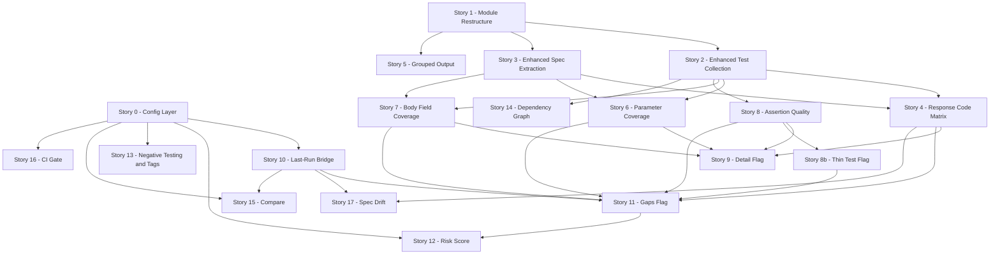

# Coverage Report v2 — Implementation Stories

**Status:** Ready for implementation  
**Created:** 2026-07-03  
**Supersedes:** [`docs/product-stories/coverage-command.md`](../coverage-command.md)  
**Source plans:**
- [`docs/coverage-v2-plan.md`](../../coverage-v2-plan.md) — original v2 plan
- [`docs/shogun-coverage-report-v2-test-team-feedback.md`](../../shogun-coverage-report-v2-test-team-feedback.md) — test team review
- [`docs/coverage-v2-plan-revised.md`](../../coverage-v2-plan-revised.md) — revised plan incorporating feedback

---

## Story Index

| Story | File | Wave | Status |
|-------|------|------|--------|
| Story 0 — Coverage Config Layer | [story-0-config-layer.md](story-0-config-layer.md) | 1 | Ready |
| Story 1 — Module Restructure | [story-1-module-restructure.md](story-1-module-restructure.md) | 1 | Ready |
| Story 2 — Enhanced Test Collection | [story-2-enhanced-test-collection.md](story-2-enhanced-test-collection.md) | 1 | Ready |
| Story 3 — Enhanced Spec Extraction | [story-3-enhanced-spec-extraction.md](story-3-enhanced-spec-extraction.md) | 1 | Ready |
| Story 4 — Response Code Coverage Matrix | [story-4-response-code-matrix.md](story-4-response-code-matrix.md) | 1 | Ready |
| Story 5 — Grouped Output by Spec Tag | [story-5-grouped-output.md](story-5-grouped-output.md) | 1 | Ready |
| Story 6 — Parameter Coverage | [story-6-parameter-coverage.md](story-6-parameter-coverage.md) | 2 | Ready |
| Story 7 — Request Body Field Coverage | [story-7-body-field-coverage.md](story-7-body-field-coverage.md) | 2 | Ready |
| Story 8 — Assertion Quality Metrics | [story-8-assertion-quality.md](story-8-assertion-quality.md) | 2 | Ready |
| Story 8b — Thin Test Flag | [story-8b-thin-test-flag.md](story-8b-thin-test-flag.md) | 2 | Ready |
| Story 9 — `--detail` Flag | [story-9-detail-flag.md](story-9-detail-flag.md) | 2 | Ready |
| Story 10 — `--last-run` Integration | [story-10-last-run-bridge.md](story-10-last-run-bridge.md) | 3 | Ready |
| Story 11 — `--gaps` Flag | [story-11-gaps-flag.md](story-11-gaps-flag.md) | 3 | Ready |
| Story 12 — Coverage Risk Score | [story-12-risk-score.md](story-12-risk-score.md) | 3 | Ready |
| Story 13 — Negative Testing and Tag Intelligence | [story-13-negative-testing-tags.md](story-13-negative-testing-tags.md) | 4 | Ready |
| Story 14 — Test Dependency Graph | [story-14-dependency-graph.md](story-14-dependency-graph.md) | 4 | Ready |
| Story 15 — `--compare` Flag | [story-15-compare.md](story-15-compare.md) | 4 | Ready |
| Story 16 — `--min-coverage` CI Gate + `--out` + JSON Fix | [story-16-ci-gate.md](story-16-ci-gate.md) | 4 | Ready |
| Story 17 — Spec Drift Detection | [story-17-spec-drift.md](story-17-spec-drift.md) | 4 | Ready |

---

## Implementation Waves

```
Wave 1 — Foundations (must ship first, everything depends on these)
  Story 0   Config layer — CoverageConfig type + loader extension
  Story 1   Module restructure — coverage.ts → src/commands/coverage/
  Story 2   Enhanced test collection — full metadata extraction
  Story 3   Enhanced spec extraction — response codes, params, body schemas
  Story 4   Response code coverage matrix — highest-value visible output
  Story 5   Grouped output by spec tag — readability

Wave 2 — Depth Dimensions
  Story 6   Parameter coverage
  Story 7   Request body field coverage
  Story 8   Assertion quality metrics
  Story 8b  Thin test flag
  Story 9   --detail flag (progressive disclosure)

Wave 3 — Intelligence
  Story 10  --last-run bridge (run results join)
  Story 11  --gaps flag (unified gap analysis)
  Story 12  Coverage risk score

Wave 4 — Advanced
  Story 13  Negative testing + tag intelligence
  Story 14  Test dependency graph
  Story 15  --compare (two-run delta)
  Story 16  --min-coverage CI gate + --out + JSON truncation fix
  Story 17  Spec drift detection
```

---

## Dependency Graph



---

## Key Design Decisions

### Module Structure

The existing [`src/commands/coverage.ts`](../../../src/commands/coverage.ts) is split into `src/commands/coverage/` in Story 1. All subsequent stories add to this directory. The public entry point `coverage(args)` stays at `src/commands/coverage/index.ts` with the same signature.

### Config-First

Story 0 ships first. Every configurable knob (risk weights, tag mappings, default suite, min-coverage thresholds) is wired through `resolveCoverageConfig()` from the start. Downstream stories consume config — they do not hardcode values.

### Static-First, Run-Optional

The default `shogun coverage` run is always static (spec + test YAML only). Run data is opt-in via `--last-run` or `--run <id>`. This preserves the "no HTTP, read-only" guarantee and makes the command safe for CI without a prior run.

### Progressive Disclosure

- Base report: compact summary + grouped endpoint list
- `--detail`: adds per-endpoint depth matrix
- `--gaps`: replaces endpoint list with prioritized gap analysis
- `--last-run`: adds run data to all of the above
- `--deps`: adds dependency graph section

### Inline Drift

Spec drift (undocumented actual codes, test-vs-reality mismatches) is surfaced inline in the response code matrix with `⚠️` and `↔` markers — not buried in a separate section. A reviewer scanning the matrix sees drift immediately.

---

## Files Created by This Story Set

```
src/commands/coverage/
  index.ts              (Story 1 — restructure, then extended by all stories)
  types.ts              (Story 1 — internal types, extended by all stories)
  spec-extractor.ts     (Story 1 — extracted, enhanced in Story 3)
  test-collector.ts     (Story 1 — extracted, enhanced in Story 2)
  matcher.ts            (Story 1 — extracted verbatim)
  analyzer.ts           (Story 1 — stub, filled in Stories 4-14)
  run-loader.ts         (Story 1 — stub, filled in Story 10)
  reporter/
    pretty.ts           (Story 1 — extracted, extended by all stories)
    json.ts             (Story 1 — extracted, extended by all stories)
    markdown.ts         (Story 1 — extracted, extended by Stories 4-5)
    gaps.ts             (Story 8b — stub, filled in Story 11)

src/types.ts            (Story 0 — CoverageConfig type added)
src/loader.ts           (Story 0 — Zod schema + resolveCoverageConfig added)
src/index.ts            (Stories 9, 10, 11, 14, 15, 16 — new CLI flags)
```
